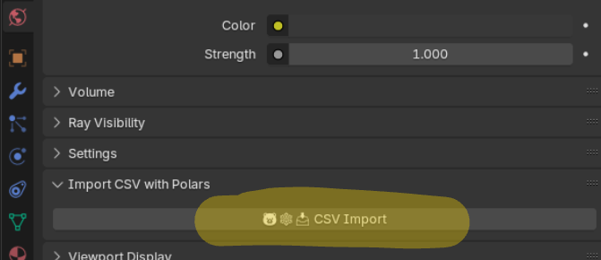
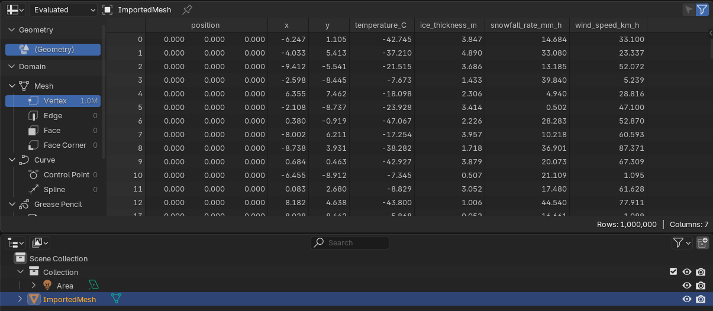

# blender_csv_import
Blender extension to add CSV files


# Usage

Go to World -> "Import CSV with Polars" -> CSV Import -> Choose the file.




And the data will show up in the speadsheet:




# Using data with Geometry Nodes:


# Development instructions

1. Install https://github.com/JacquesLucke/blender_vscode
2. Enable the setting "Blender › Addon: Reload On Save"
3. Command+Shift+P -> Blender: Build and Start
4. Start coding with __init__.py

### Build the extension:

For downloading the wheels files, run: 
```
/Applications/Blender.app/Contents/MacOS/Blender -b -P build.py
```
For building the app for all platforms, run
```
/Applications/Blender.app/Contents/MacOS/Blender --command extension build --split-platforms
```

